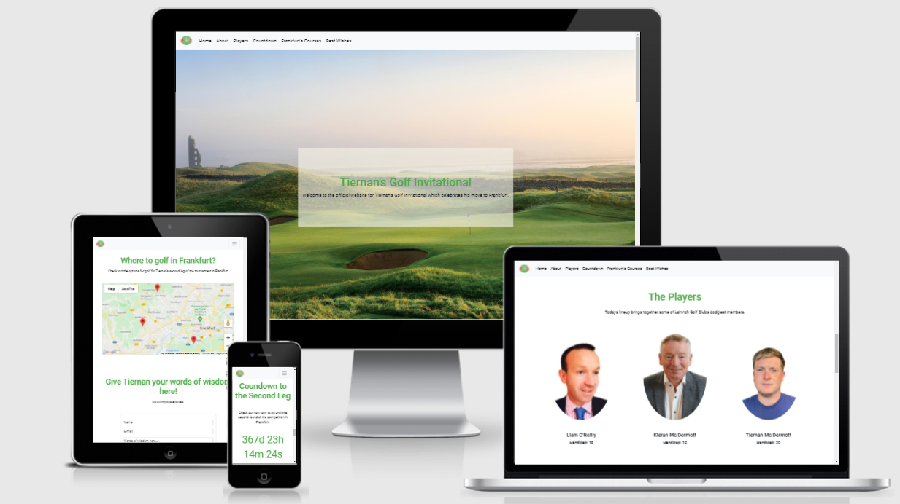

# **Tiernan's Golf Invitational**

# **Website Overview**
Welcome to the website that I have created for both my Ms2 Project but one that also plays a very real function. I move to Frankfurt, Germany on the 27th of May to start a new job and a new chapter in my life. As the dealine for this milestone project lay so close to this date, I wondered how I could create something that would serve a purpose of being part of the celebration of my move. I come from family that loves golf and I knew that I would want to play one final round in my home club along with my father Kieran and my uncle Liam. I decided I would make this golf outing into a two legged tournament. With the first leg in Ireland and the second leg in Frankfurt Germany. The link to this website will be forwarded to my father and my uncle Liam on the morning of the round of golf in Lahinch.

Find a link to the live website [**here**](https://tiernan97.github.io/MS2-TiernansGolfInvitational/)

# **User Experience (UX)**
+ ## **User Journey**
    + **Liam and Kieran**
        1. I want to gain a basic understanding of what the website is about.
        2. I want  to see who else is playing, learning basic information about the players, particularly about their handicaps.
        3. I want the user to feel as though they are already on the course in Lahinch from the hero image.
        4. I want to easily find the other relevant social media accounts for lahinch golf club.
        5. I want to be able to send Tiernan some private words of advice.
        6. I want to be able to see how long it is until the second leg of the competition.
        7. I want to be able to see what courses we may be playing for the second leg of the tournament in Frankfurt, including basic information such as pricing and proximity to the city.

           In the context of the development stage of the business, this user persona is what the website is built for. Our social media content creation begins in the coming weeks. From this we hope to drive traffic to this website. The ultimate goal is to give them a further insight into what we do and to have them sign up to be notified of our first stock launch.
+ ## **Design**
    + **Color Scheme**
      + When deciding on the colour scheme I was careful to balance my use of Lahinch Golf Clubs shade of green throughout.
      1. **Nav Bar & Footer**: For my nav bar and footer I used a basic light grey background. This was to avoid any major color or theme clashes throughout the website. The light grey added a level of depth without affecting the visibility of my nav bar options.

      2. **Main Body**: For the main body of the website I used a white background to ensure that the content being delivered was as legible as possible. Similiar to the grey navbar, white allowed for less theme clashes and helped draw attention to my main landing image. 

      3. **Social Icons**: For the social media Icons I decided to custom style them to be in line with Lahinch Golf Club's logo. My rational for this is that all of my submit buttons were also green. My hope was that users would recognise another opportunity to click.

    + **Typography**  

      + When decising on the typography I wanted for my website, I drew learnings from my advertising and marketing modules from my time in University College Cork. Here I researched the effectiveness of different font types in delivering a message to a consumer/user. I wanted to use a font that was similiar to 'Helvetica' but I also felt this lacked some personality. I decided to settle on **'Roboto'** which is very similiar to 'Helvetica'. **'Sans-serif'** was set as my backup font.
 
    + **Imagery**
    
      + **Home Section Image**: Deciding on my home section image was quintessential to the user experience in my website. I wanted Liam and Kieran to immediately draw familiarity with the course that we love so much. 
      + **The Players Section Images**: The images used in the 'Players' section of the website were all selected due to their common theme. It was quite difficult to get similiar images of each of us. It was important that they were relatively uniform and didn't distract too much from the other important content around them.

    + **Mockups**

      + From my previous experience with [Moqups](https://moqups.com/), I decided that sketches were the best option for me wireframing for this project. The scope of what I wanted for the project meant that the Moqups platform was not fit for purpose.

      1.  Mobile Version Mockup

      2.  Home Page Mockup

      # **Features**
      + This website is responsive on all devices.
      + This website uses external links which are embedded under clickable images.
      + The website uses an EmailJS API so that users can send Tiernan a farewell message. This message is sent to his email address.
      + The fixed nav bar which has spy scroll bootstrapped allows for the user to conveniently navigate their way through the one page scroller.
      + This website includes a custom 404 error page that is triggered when users input the wrong URL. 
      + This website has custom styling for the players section images where the image zooms on hover.
      + This website has a custom Google Maps API which has custom marker that display a pop-up on being clicked. 
      + This website contains a countdown timer using Javascript which counts down to the date of the second leg of the competition. Upon the timer reaching 0, an alternative message is then displayed.

      # **Technologies Used**
      ## **Languages Used**

      + [**HTML5**](https://en.wikipedia.org/wiki/HTML)
      + [**CSS3**](https://en.wikipedia.org/wiki/CSS)
      + [**Javascript**](https://en.wikipedia.org/wiki/JavaScript)

      ## **Frameworks, Libraries & Programs Used**

      1. [**Bootstrap 4.5.3:**](https://getbootstrap.com/)
         + I used Bootstrap4 to help  with the responsiveness of my website. It's grid structures and pre-made layouts helped a lot with this website.

      2. [**Google Fonts:**](https://fonts.google.com/)
         + I used google fonts to emmbed my **'Roboto'** font throughout my website.

      3. [**Font Awesome:**](https://fontawesome.com/)
         + Font Awesome came in very useful when searching for icons that matched the aesthetic of the website and improved user experience.

      4. [**jQuery:**](https://jquery.com/)
         + jQuery came as part of the Bootstrap4 package. It added stylistic and functional elements to my website.

      5. [**Git:**](https://git-scm.com/)
         + This was the version control tool I used throughout my development of this project. It allowed me to version control so to go back to previous itterations of my code.

      6. [**GitHub:**](https://github.com/)
         + This was the repository where I pushed all of my stored code.

      7. [**Canva:**](https://canva.com/)
         + I used canva to source some of my images with my pro version of the software. I also used this to crop and resize the images to meet the websites requirements. 

      8. [**Moqups**](https://moqups.com/)
         + I used Moqups to generate my Mockups for both the Mobile and Full sized webite pages. This tool was very useful as a guiding framework for the remainder of the project.

      9. [**Notepad++:**](https://notepad-plus-plus.org/)
         + I used this free source code editor for expirementation and just to generally gain more experience with other web development tools.
      
      10. [**Google Maps API**](https://developers.google.com/maps)
         + I used this API to embed a Google Map of Frankfurt in my page.

      11. [**EmailJS**](https://www.emailjs.com/)
         + I used this API to generate an email to be sent to my email address upon the users successful completion of a form.
      

      # **Testing**

      ## **Functionality Testing**
      + The player images were tested for interavtive ability responsiveness on all sizes.
      + The google map api was tested on all sizes for interactive ability and responsiveness
      + The collapsable nav bar in the header was changed for the 404 error page so that it would not have buttons or a dropdown.
      + The emailJS was tested to ensure that the correct email was sending, along with the correct alert for successful submission.

      ## **Validators**
      + [**HTML5 Validator**](https://validator.w3.org/nu/#textarea)
      + [**CSS3 Validator**](http://jigsaw.w3.org/css-validator/images/vcss)
      
      ## **Results:**
      + Both validators have passed with full marks. There are no errors in the code.

      ## **Testing User Journey**
      + To avoid bias, I asked a number of other golfers along with Kieran and Liam to test the website. It was as follows:

      1. When a user comes onto the website they get a good sense of the event that the website is for.

      2. They also felt that from their use of the website they felt that their understanding of who was part of this competition was clear and they felt they got to know the players a little, a golfers handicap telling a lot about their game.

      3. These users said that they also found it easy to identify where to follow other social media outlets associated.

      4. The users stated that the constant call to actions throughout meant that they always felt a sense of direction in the site.

      5. The users stated that the countdown functionality created an air of suspence and anticipation. 

      6. The users stated that they enjoyed the opportunity to be able to interact with the website through submitting their unique message which would be sent to Tiernan.

      7. The users enjoyed their interactions with the custom google map api, particularly because of it's relevance to the two legged golf invitataional.

      ## **Testing Demographics**
      
      + All of those tested were golfers.
      + The youngest user was 10 years of age.
      + The oldest user was 81 years of age. 
      + The average age of users tested was 27.
      + From the tech savy to the less tech savy users, there were no indicators that the golfer users were unsure of (i) The purpose of the website (ii) how to interact with the website.

      ## **More Extensive Testing**
      + To ensure no errors I conducted further testing on the following web browsers successfully:
     
      1. [**Chrome**](https://www.google.com/intl/en_ie/chrome/)

      2. [**Safari**](https://www.apple.com/safari/)

      3. [**Firefox**](https://www.mozilla.org/en-US/firefox/new/)

      4. [**Microsoft Edge**](https://www.microsoft.com/en-us/edge)

      + To ensure compatability across all devices I tested the webesite on Lenovo IdeaPad S540, iPhone 8 Plus, iPhone 11, iPhone 12, iPad Pro, iPad and Samsung S9.

      ## **Bugs**
      + I was having some issues with my EmailJS integration. I was focusing on my code working in the repository when in fact the issue lay in the email template I had generated on the EmailJS platform. I had forgotten to make the relevant changes to the variables on my template. Once I had changed this it worked smoothly

      # **Deployment**
      ## **How to use [**GitHub Pages**]((https://pages.github.com/)) to Deploy the website:**
      1. Log into the Github website.

      2. WIthin the repository section at the top you find the "Settings" button on the menu.
      3. Find the section labelled "Github Pages" within the settings section.
      4. Under the "Source" you click the dropdown which is called "None" and  you select "Master Branch".
      5. The page will then refresh itself.
      6. You can then go and find your link which is published in the "Github Pages" section. 

      ## **How to Clone this website:**

      1. Log into the GitHub website and go to the 'Github Repository'

      2. Locate the repository used for this project and click 'Clone/Download'

      3. You can alternatively clone this project by using the 'Clone with HTTPS'.

      4. You copy the HTTPS link and open 'Git Bash'

      5. Alter the working directory to the new location you want the cloned directory to be.

      6. Type 'git clone' in your 'Git Bash' and then past the https .

      7. Then to create this cloned directory hit enter.

    
    # **Credits**

  ## **Code**
  + The code frameworks from [**'Bootstrap 4'**](https://getbootstrap.com/) played a major role in me putting this website together.

  + I took inspiration from the tutorials on [**'w3schools'**](https://www.w3schools.com/) which was instrumental in me ovecoming errors in my code throughout. 
  
  + A video tutorial on [**Youtube**](https://www.youtube.com/channel/UCzyuZJ8zZ-Lhfnz41DG5qLw) from creator 'Danny Krossing' whos channel is linked was helpful in my understanding of setting up my custom 404 error page.

  + There was some useful forums on [**Stackflow**](https://stackoverflow.com/questions/24190830/bootstrap-responsive-img-but-change-image-height-and-width/24191011) which helped me with responsive image design.

  + I was provided with an example of a nice map pop-up on click format. It was of great help as a guide and reference point. [**Click Here**](https://slavabdev.github.io/MS2-coffeeshop-website/locations.html)

  ## **Content** 
  + All Content was written my I Tiernan Mc Dermott, the developer.
  + All market research references were with reference to 1.1 graded postgraduate research activivites conducted behalf of the Tangent Dept of Trinity College Dublin.
  + I found inspiration from other slack participants Milestone 2 projects.
  
  ## **Media**
   + My images were sourced from [**Canva**](https://www.canva.com/) and [**Pixabay**](https://pixabay.com/).

  ## **Acknowledgements** 
  + I would like to give a very  special thanks to my mentor [Medale Oluwafemi](https://github.com/omedale) who was instrumental in guiding me through this process. He always points out areas of my code that I can improve upon.

  + I would like to say a big thank you to all at Code Institute for helping me along the way. I would like to give a particularly huge thank you to John in the tutor assistance team. He really put me at ease on so many occasions where I felt overwhelmed.

  + I want to say a massive thank you to the Slack community. It has been so great to get all of your help and feedback throughout the process.
